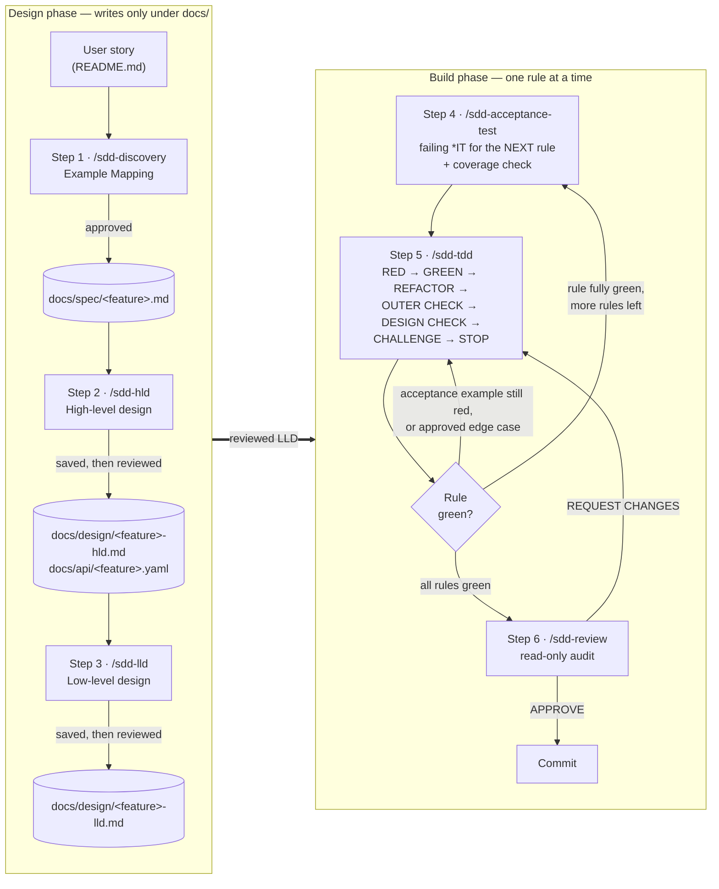
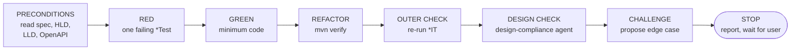

# Spec-Driven Development (SDD) Workflow

This document explains how features are built in this repository. Every feature goes through the
same six steps, each driven by a Claude Code slash command in `.claude/commands/`. Each step
produces an artifact that the next step reads as its contract, and each step ends with a
**STOP** so a human can review before anything moves forward.

> **Golden rule:** no test or production code is written until the spec has been approved and the
> high-level and low-level designs have been reviewed. After that, code is written one rule at a
> time, one unit test at a time.

This guide covers the *process*. The exact instructions live in the command and agent files, and
the coding conventions every step enforces live in [`CLAUDE.md`](CLAUDE.md).

---

<a id="table-of-contents"></a>
## Table of Contents

- [1. Overview](#overview)
- [2. Failure modes and guardrails](#failure-modes-and-guardrails)
- [3. Step 1 — Discovery (`/sdd-discovery`)](#step-1-discovery-sdd-discovery)
- [4. Step 2 — High-Level Design (`/sdd-hld`)](#step-2-high-level-design-sdd-hld)
- [5. Step 3 — Low-Level Design (`/sdd-lld`)](#step-3-low-level-design-sdd-lld)
- [6. Step 4 — Acceptance Test (`/sdd-acceptance-test`)](#step-4-acceptance-test-sdd-acceptance-test)
- [7. Step 5 — TDD inner loop (`/sdd-tdd`)](#step-5-tdd-inner-loop-sdd-tdd)
- [8. Step 6 — Review (`/sdd-review`)](#step-6-review-sdd-review)
- [9. Compliance checks](#compliance-checks)
    - [`spec-compliance` sub-agent](#spec-compliance-sub-agent)
    - [`design-compliance` sub-agent](#design-compliance-sub-agent)
- [10. Hooks and permissions](#hooks-and-permissions)
- [11. Artifacts at a glance](#artifacts-at-a-glance)
- [12. Conclusion — Harness and guardrails](#conclusion-harness-and-guardrails)

---

<a id="overview"></a>
## 1. Overview



| Step | Command | Model | Input | Output | Writes code? |
|------|---------|-------|-------|--------|--------------|
| 1 | `/sdd-discovery "<story>"` | opus | User story | `docs/spec/<feature>.md` | No |
| 2 | `/sdd-hld @docs/spec/<feature>.md` | opus | Spec | `docs/design/<feature>-hld.md`, `docs/api/<feature>.yaml` | No |
| 3 | `/sdd-lld @docs/design/<feature>-hld.md` | opus | Spec + HLD + OpenAPI | `docs/design/<feature>-lld.md` | No |
| 4 | `/sdd-acceptance-test "<rule>" @docs/spec/<feature>.md @docs/design/<feature>-lld.md` | sonnet | Spec + HLD + LLD + OpenAPI | `acceptance/<Feature>IT.java` (one new `@Nested` per run), `schema.sql` DDL | Test only |
| 5 | `/sdd-tdd "<acceptance example>" @docs/design/<feature>-lld.md` | sonnet | Red acceptance test + spec + HLD + LLD + OpenAPI | One `*Test` + minimum production code per cycle, checked against the design | Yes |
| 6 | `/sdd-review` | opus | Uncommitted diff + all docs | Review report (no file changes) | No |

The design steps use **opus** because they involve judgement and trade-offs; the build steps use
**sonnet** because they are tightly constrained by the artifacts already approved.

<p align="right"><a href="#table-of-contents">Back to top ↑</a></p>

---

<a id="failure-modes-and-guardrails"></a>
## 2. Failure modes and guardrails

AI-assisted coding fails in predictable ways. Each step is built to counter one or more of them:

| Failure mode | Guardrail |
|--------------|-----------|
| Inventing behaviour or examples | The spec is the contract. Raise a question instead; the `spec-compliance` agent flags tests the spec doesn't contain. |
| Resolving ambiguity silently | Open questions are asked one at a time with options; nothing is saved with unresolved questions. |
| Saving a spec before approval | Present in chat, wait for explicit approval, then save. |
| Building on an unreviewed design | `/sdd-hld` and `/sdd-lld` save directly, then STOP; nothing downstream starts until the user has reviewed the saved files. |
| Skipping design because the feature "is simple" | Design steps are mandatory; they're fast when the feature is simple. |
| Big-bang implementation | One rule per `/sdd-acceptance-test` run, one unit test per `/sdd-tdd` cycle, STOP after each. |
| Design drift (e.g. silently renaming an LLD class) | TDD follows the LLD or STOPs to propose a change; `design-compliance` checks every cycle. |
| Tweaking a test to make it pass | Fix production code; tests are the contract. |
| Weak tests | Acceptance tests assert exact spec values; review flags `assertNotNull`-style checks. |
| Running `mvn test` and thinking acceptance is green | `mvn test` skips `*IT`; use `mvn verify` or `-Dit.test=…`. |
| Entity changed but `schema.sql` not | Every `@SpringBootTest` fails at context startup — update DDL in the same cycle. |
| Skipping a compliance check "because the change is small" | Always run it; a missing `Result:` line in the step's report shows it was skipped. |
| Changing a command or agent without updating this document | Update `README.md` in the same change (see `CLAUDE.md`). |

<p align="right"><a href="#table-of-contents">Back to top ↑</a></p>

---

<a id="step-1-discovery-sdd-discovery"></a>
## 3. Step 1 — Discovery (`/sdd-discovery`)

**Goal:** turn a user story into a precise, testable set of business rules, using
[Example Mapping](https://cucumber.io/blog/bdd/example-mapping-introduction/).

```text
/sdd-discovery "As a registered customer, I want to place an order for multiple products in my cart,
so that the items are successfully reserved and prepared for shipping"
```

Each rule starts with *"Should…"* or *"Must…"* and has examples (*"The one where…"*, or a table when
inputs vary independently), counter-examples (valid business boundaries, not bugs) and questions:

```text
- Rule: Must reject an order when the customer is not active
    - Example: The one where an active customer places an order and it is accepted
    - Counter-example: The one where a suspended customer places an order and it is rejected
    - Questions: Is a customer with an unverified email "active"?
```

Examples use plain business language, and each covers a *distinct* outcome or boundary — normal
case first, then boundaries only. Questions are asked **one at a time** with options, and the
answers are folded into the rules.

**Exit criteria:** the complete spec is presented → **STOP** → after approval saved to
`docs/spec/<feature>.md` with zero open questions.

<p align="right"><a href="#table-of-contents">Back to top ↑</a></p>

---

<a id="step-2-high-level-design-sdd-hld"></a>
## 4. Step 2 — High-Level Design (`/sdd-hld`)

**Goal:** decide the *shape* of the solution — components, API, data model, flows — before any
code exists. Existing entities, endpoints and the error format are reused, not duplicated.

```text
/sdd-hld @docs/spec/<feature>.md
```

The document is written in the **present simple tense**, with constraints in RFC 2119 keywords
(MUST / SHOULD). It opens with a **Table of Contents** and ends every section and sub-section with
a right-aligned **[Back to Top]** link to it. All diagrams are Mermaid and must parse: no `;` in labels or messages (other than in entity codes),
`<…>` placeholders escaped (`#lt;…#gt;` / `&lt;…&gt;`), and special characters in flowchart labels
quoted. Every diagram marks new vs existing, the `erDiagram` matches the data model (enums as
`VARCHAR`, money as `DECIMAL(19,2)`), and no open questions remain. These rules live in
`.claude/rules/design-rules.md` (scoped to `docs/design/**`), which the command reads and
re-checks before saving. The same rules apply to the LLD.

| # | Section | Content |
|---|---------|---------|
| 1 | Context | Actors, what the feature does for them, external dependencies (or "none"). |
| 2 | Component diagram | `flowchart`, `subgraph` per layer, new vs existing. |
| 3 | API | Per endpoint: method, path, bodies, status codes, `ErrorResponse(message)`. |
| 4 | Data model | `erDiagram` of entities and relationships. |
| 5 | Key flows | One `sequenceDiagram` **per spec rule** — happy path + main rejection path. |
| 6 | Error catalogue | Domain exception → HTTP status → message `"<Business reason>: <id>"`. |
| 7 | Design decisions | One line each: transactions, concurrency, idempotency, rounding — only what the spec forces. |
| 8 | Rule traceability | Every spec rule → endpoint + flow. A rule with no home is a blocker. |

Alongside it comes an **OpenAPI 3.1** contract, which later steps and the review check the code
against. Open design choices are asked one at a time, recommended option first.

**Exit criteria:** HLD + YAML saved directly (no approval prompt) to
`docs/design/<feature>-hld.md` and `docs/api/<feature>.yaml` → short summary in chat → **STOP** →
the user reviews the saved files, and requested changes are applied to them. No Java, DDL, tests
or class signatures — those belong to the LLD.

<p align="right"><a href="#table-of-contents">Back to top ↑</a></p>

---

<a id="step-3-low-level-design-sdd-lld"></a>
## 5. Step 3 — Low-Level Design (`/sdd-lld`)

**Goal:** a class-level blueprint with **no method bodies**.

```text
/sdd-lld @docs/design/<feature>-hld.md
```

It contains a `classDiagram` and an `erDiagram`, then per package: controller handlers, service
methods (and the rules each enforces), repository queries, entity ↔ column mapping, DTO validation,
exceptions and message templates, the exact DDL for `schema.sql` (shown, not applied), money
computations, a **test plan** per rule/example, and the **implementation order** of the rules.

The LLD must not change the HLD or the API contract; if it has to, it STOPs and the user decides
whether to go back to `/sdd-hld`.

Like the HLD, the LLD follows `.claude/rules/design-rules.md`: **present simple tense**, a
**Table of Contents**, a right-aligned **[Back to Top]** link per section, Mermaid diagrams that
parse, `<<new>>` / `<<modified>>` markers, an `erDiagram` that matches the DDL exactly, and no
open questions.

**Exit criteria:** LLD saved directly (no approval prompt) to `docs/design/<feature>-lld.md` →
short summary in chat → **STOP** → the user reviews the saved file, and requested changes are
applied to it.

<p align="right"><a href="#table-of-contents">Back to top ↑</a></p>

---

<a id="step-4-acceptance-test-sdd-acceptance-test"></a>
## 6. Step 4 — Acceptance Test (`/sdd-acceptance-test`)

**Goal:** write a **failing** end-to-end test for the **next rule only** (as ordered by the LLD).

```text
/sdd-acceptance-test "Must reject an order when the customer is not active" @docs/spec/place-order.md @docs/design/place-order-lld.md
```

```text
src/test/java/<base package>/acceptance/PlaceOrderIT.java

@SpringBootTest + MockMvc
class PlaceOrderIT                                  ← one class per feature
 └─ @Nested @DisplayName("<rule name>")             ← one per rule
     ├─ @Test @DisplayName("The one where …")       ← one per spec example
     └─ @Test @DisplayName("The one where …")
```

The test drives real HTTP through MockMvc against the full stack with **no mocks**, seeds data with
`JdbcTemplate`, and asserts exact spec values. Paths, fields and status codes come from the OpenAPI
contract; error messages from the HLD error catalogue. If the rule needs new tables or columns,
only **this rule's** DDL is copied from the LLD into `schema.sql`.

<a id="failing-for-the-right-reason"></a>
### Failing for the right reason

Run with `mvn -Dit.test=<Feature>IT verify`.

| Outcome | Meaning | Action |
|---------|---------|--------|
| 404 / wrong status / compilation error | Behaviour missing | ✅ Correct — report and STOP |
| Context startup failure, bad seed data, wrong URL or JSON path | Test is broken | Fix the **test**, re-run |
| Test passes | Test asserts nothing useful | Fix the **test**, re-run |

Never write production code to change *how* a test fails.

**Exit criteria:** the [`spec-compliance`](#spec-compliance-sub-agent) agent reports no gaps for
the rule, the test still fails for the right reason → **STOP**.

<p align="right"><a href="#table-of-contents">Back to top ↑</a></p>

---

<a id="step-5-tdd-inner-loop-sdd-tdd"></a>
## 7. Step 5 — TDD inner loop (`/sdd-tdd`)

**Goal:** make the red acceptance examples green through small, unit-test-driven cycles. Each
invocation runs **exactly one** cycle.

```text
/sdd-tdd "PlaceOrderIT Rule 1 example 2" @docs/design/place-order-lld.md
```



| Phase | What happens |
|-------|--------------|
| PRECONDITIONS | Read spec, HLD, LLD and OpenAPI; STOP if any is missing. Code that doesn't match the design is a defect even when tests pass. |
| RED | Pick the next smallest missing behaviour; write **one** `*Test` at the level the LLD test plan names (service, controller or repository). It must fail, for an understood reason. |
| GREEN | Minimum code, following LLD names and signatures. If the design is wrong, STOP and propose a change. Entity changes update `schema.sql` in the same cycle. |
| REFACTOR | Remove duplication, improve names, then run **all** tests with `mvn verify`. |
| OUTER CHECK | Re-run the `*IT`. Still red → name the missing behaviour as the next RED; don't start it. |
| DESIGN CHECK | Run the [`design-compliance`](#design-compliance-sub-agent) agent on the changed files. DRIFT → fix the code as a refactor, or STOP and propose an LLD change. |
| CHALLENGE | Propose at least one edge case. If approved, it becomes the **next** RED. |
| STOP | Report the test added, acceptance state, code changed, design result and edge case. Wait. |

**Hard limits:** one new unit test per cycle; never modify the acceptance test or an existing test
to make it pass; no unrequested features.

<a id="how-steps-4-and-5-interleave"></a>
### How Steps 4 and 5 interleave

```text
for each rule in LLD implementation order:
    /sdd-acceptance-test <rule>           → *IT red, coverage checked
    repeat:
        /sdd-tdd <red example>            → one unit test, minimum code, design check
    until every example of the rule is green
```

<p align="right"><a href="#table-of-contents">Back to top ↑</a></p>

---

<a id="step-6-review-sdd-review"></a>
## 8. Step 6 — Review (`/sdd-review`)

**Goal:** catch what passing tests won't — architecture violations, naming, weak assertions,
contract and design drift, missing spec coverage.

```text
/sdd-review
```

The review is **read-only**: it edits nothing (not even `CLAUDE.md`) and doesn't run the build. It
audits the uncommitted changes (or `HEAD` if the tree is clean) against the checklist in
`.claude/commands/sdd-review.md` and ends with **APPROVE**, **APPROVE WITH NOTES** or
**REQUEST CHANGES**. Any proposed `CLAUDE.md` updates are applied only after the user agrees.

<p align="right"><a href="#table-of-contents">Back to top ↑</a></p>

---

<a id="compliance-checks"></a>
## 9. Compliance checks

The approved spec and designs are enforced in four layers, from earliest to latest:

| Layer | When | What it catches |
|-------|------|-----------------|
| Preconditions | Start of every `/sdd-acceptance-test` and `/sdd-tdd` run | Missing or contradictory design artifacts |
| Coverage check | End of every `/sdd-acceptance-test` run (`spec-compliance`) | Spec examples with no `@Test`, and tests the spec doesn't contain |
| DESIGN CHECK | End of every TDD cycle (`design-compliance`) | Drift in classes, signatures, columns, DTO fields, exception messages and handlers, plus undesigned code |
| Review | `/sdd-review`, before commit | Any remaining deviation across the whole change |

Both agents are read-only haiku agents defined in `.claude/agents/`. Neither runs on its own: the
calling command starts it through the **Agent tool**, and the agent sees none of the conversation,
so the prompt must name the files. Each agent ends with a `Result:` line that the calling command
includes in its report. This is prompt-level enforcement — nothing in the build fails if a check is
skipped.

<a id="spec-compliance-sub-agent"></a>
### `spec-compliance` sub-agent

Maps each spec rule and example to test methods and reports `COVERED`, `PARTIAL`, `MISSING`,
`UNSPECIFIED` and `NOT YET TESTED` (rules outside the requested scope). It checks that tests exist
and match the spec, not that they pass. Started by `/sdd-acceptance-test` with the spec file, the
rule just tested and the `<Feature>IT` file. Run it without a rule for a whole-feature audit before
`/sdd-review`.

<a id="design-compliance-sub-agent"></a>
### `design-compliance` sub-agent

Compares `src/main/java/**` and `schema.sql` with the LLD, HLD and OpenAPI contract and reports
`CONFORMS`, `DRIFT`, `UNDESIGNED` and `NOT YET BUILT` (designed but not built yet, which is not a
failure). Started by `/sdd-tdd` in every DESIGN CHECK with the feature name and the production
files changed in the cycle.

<p align="right"><a href="#table-of-contents">Back to top ↑</a></p>

---

<a id="hooks-and-permissions"></a>
## 10. Hooks and permissions

`.claude/settings.json` pre-approves `mvn test *` and `mvn install *`, plus file edits under
`docs/design/**` and `docs/api/**` (`Edit(...)` rules, which also cover Write), so saving or
revising an HLD, LLD or OpenAPI contract never prompts. `/sdd-hld` and `/sdd-lld` also list
`Write` and `Edit` in their `allowed-tools`. The settings file also registers a `PreToolUse`
hook on `Bash` that runs `.claude/scripts/pre-commit-documentation.sh` (status message:
*"Generating technical documentation…"*).

<p align="right"><a href="#table-of-contents">Back to top ↑</a></p>

---

<a id="artifacts-at-a-glance"></a>
## 11. Artifacts at a glance

```text
docs/
├── spec/<feature>.md            ← Step 1  the business contract (rules + examples)
├── design/<feature>-hld.md      ← Step 2  shape: components, API, data, flows, decisions
├── api/<feature>.yaml           ← Step 2  OpenAPI 3.1 contract
└── design/<feature>-lld.md      ← Step 3  signatures, mappings, DDL, test plan, order
src/test/resources/schema.sql    ← Step 4/5  DDL copied from the LLD, rule by rule
src/test/java/.../acceptance/<Feature>IT.java   ← Step 4  one @Nested per rule
src/test/java/.../<pkg>/*Test.java              ← Step 5  one per TDD cycle
src/main/java/...                               ← Step 5  minimum production code
.claude/commands/sdd-*.md        ← the six steps (prompts)
.claude/agents/*-compliance.md   ← checkers started by Steps 4 and 5
.claude/rules/design-rules.md    ← Steps 2 and 3  format, Mermaid and data model rules of HLD/LLD
```

Traceability runs straight through: **spec rule → HLD flow → LLD service method + test plan row →
`@Nested` acceptance class → unit tests → review**.

<p align="right"><a href="#table-of-contents">Back to top ↑</a></p>

---

<a id="conclusion-harness-and-guardrails"></a>
## 12. Conclusion — Harness and guardrails

Everything in this document comes down to two ideas: the **harness** and the **guardrails**.

- The **harness** is everything around the model that turns it into a working agent: the context
  it is given, the tools it may call, the workflows it follows, the sub-agents it starts, and the
  loop that runs it. The model reasons and writes text. The harness decides what the model sees
  and what happens to its tool calls.
- **Guardrails** are the parts of the harness that limit or check what the agent does. They decide
  which actions are allowed and which outputs are accepted.

### The harness in this repository

| Component | Role | Where it lives |
|-----------|------|----------------|
| Context loading | Gives the model project knowledge at the start of every session | `CLAUDE.md` (architecture, money rules, test levels) |
| Tools | Let the model read and edit files, run shell commands and search | Provided by Claude Code |
| Workflows | Reusable instructions that load when a command runs | `.claude/commands/sdd-*.md` |
| Path-scoped rules | Instructions that load when the model works on matching files | `.claude/rules/*-rules.md` (e.g. `design-rules.md` for `docs/design/**`) |
| Sub-agents | Separate agents with their own context and a restricted tool set | `.claude/agents/*-compliance.md` (Read, Glob and Grep only) |
| Settings | Permissions and lifecycle hooks | `.claude/settings.json` |
| Loop control | Plan mode, permission prompts, STOP points | Claude Code + the STOPs in every SDD step |

### Three kinds of guardrail

| Kind | Enforced by | Examples here | Can the model skip it? |
|------|-------------|---------------|------------------------|
| **Deterministic** | The harness or the build | `settings.json` permission allowlist; the `PreToolUse` hook on `Bash`; read-only tool sets for compliance agents; `ddl-auto=validate`; `mvn verify` with failsafe `*IT` | No |
| **Process** | The workflow prompts | STOP-and-approve gate for the spec; STOP-and-review after the HLD and LLD are saved; no code before they are reviewed; one unit test per TDD cycle; DESIGN CHECK every cycle | Possible, but detectable (e.g. a missing `Result:` line) |
| **Convention** | Instructions in `CLAUDE.md` | BigDecimal with `RoundingMode.DOWN`, scale 2; no AssertJ; DTOs never import Spring; constructor injection only | Possible: long contexts or ambiguous tasks can cause drift |

### The key distinction: instruction vs. enforcement

Process and convention guardrails are **instructions**. The model follows them reliably, but
compliance is probabilistic. Deterministic guardrails are **enforcement**. The harness or the
build applies them whatever the model decides. As [§9](#compliance-checks) notes, the compliance
agents are prompt-level enforcement: nothing in the build fails if a check is skipped.

The rule that follows: **the more costly it is to break a rule, the further it should move from
instruction towards enforcement.**

| Rule today (instruction) | Possible enforcement |
|--------------------------|----------------------|
| "Never `new BigDecimal(double)`" | ArchUnit test, or a `PostToolUse` hook on Edit/Write that rejects the pattern |
| "DTOs never import `org.springframework.*`"; one-way layer dependencies | ArchUnit layering test, run by `mvn verify` |
| "Never AssertJ" | Maven Enforcer `bannedDependencies`, or an ArchUnit rule on test classes |
| "Don't commit unless tests are green" | `PreToolUse` hook on `Bash` that blocks `git commit` (exit code 2) unless `mvn verify` passes |

### Summary

This workflow already uses all three kinds of guardrail. The SDD commands and compliance agents
provide the process and review layer. `CLAUDE.md` provides the conventions. `settings.json`, the
schema validation and the test suite provide enforcement. The enforcement layer is the thinnest
of the three, and strengthening it is the clearest way to make Claude-assisted development
**predictable** as well as productive. Spec-driven development gives the model a precise
contract, and guardrails make sure the result keeps to it.

<p align="right"><a href="#table-of-contents">Back to top ↑</a></p>